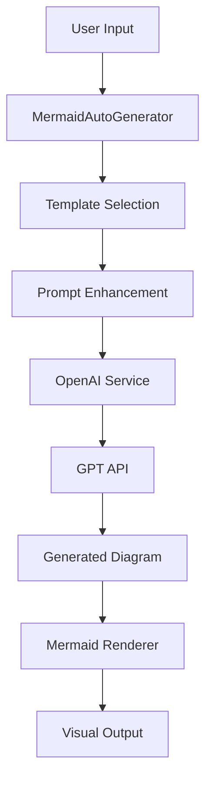

# Mermaid Auto-Generation with GPT API

This document describes the automatic Mermaid diagram generation functionality that integrates with the current GPT API to create diagrams dynamically based on user input and templates.

## Features

### 🤖 AI-Powered Generation
- **Automatic Diagram Creation**: Generate Mermaid diagrams from natural language descriptions
- **Template-Based Generation**: Use predefined templates for different diagram types
- **Industry-Specific Context**: Generate diagrams tailored to specific industries
- **Complexity Control**: Simple, medium, or complex diagram generation
- **Style Options**: Minimal, detailed, or professional styling

### 🎯 Multiple Generation Modes

#### 1. Enhanced Editor Mode
- **Template Selection**: Choose from predefined diagram templates
- **Settings Panel**: Configure industry, complexity, and style
- **Real-time Preview**: See diagrams as they're generated
- **Code Editor**: Edit generated code manually
- **Export Options**: Download as SVG, PNG, or copy code

#### 2. Chat Interface Mode
- **Conversational Generation**: Chat with AI to create diagrams
- **Multiple Diagrams**: Generate diagram suites for complex topics
- **History Tracking**: Keep track of generated diagrams
- **Interactive Feedback**: Real-time generation status

#### 3. Classic Editor Mode
- **Traditional Interface**: Original Mermaid editor functionality
- **Template Library**: Access to all diagram templates
- **Manual Editing**: Full control over diagram code

## Architecture

### Core Components

```
src/
├── services/
│   ├── mermaidAutoGenerator.ts     # Main auto-generation service
│   └── openai.service.ts           # GPT API integration
├── components/
│   ├── EnhancedMermaidEditor.tsx   # AI-enhanced editor
│   ├── MermaidChatInterface.tsx    # Chat-based generation
│   ├── MermaidEditor.tsx           # Main editor with mode switching
│   └── MermaidRenderer.tsx         # Diagram rendering component
```

### Service Architecture



## Usage

### Basic Generation

```typescript
import { mermaidAutoGenerator } from '../services/mermaidAutoGenerator';

// Generate a single diagram
const diagram = await mermaidAutoGenerator.generateDiagram(
  "user authentication flow",
  {
    industry: 'banking',
    complexity: 'medium',
    style: 'professional'
  }
);
```

### Template-Based Generation

```typescript
// Get available templates
const templates = mermaidAutoGenerator.getTemplates();

// Filter by category
const processTemplates = mermaidAutoGenerator.getTemplatesByCategory('Process');

// Filter by industry
const bankingTemplates = mermaidAutoGenerator.getTemplatesByIndustry('banking');
```

### Diagram Suite Generation

```typescript
// Generate multiple diagrams for a complex topic
const diagrams = await mermaidAutoGenerator.generateDiagramSuite(
  "e-commerce system architecture",
  {
    industry: 'ecommerce',
    complexity: 'complex',
    style: 'detailed'
  }
);
```

## Templates

### Available Template Categories

1. **Process Templates**
   - Basic Flowchart
   - State Workflow
   - Gantt Project Timeline

2. **Integration Templates**
   - API Sequence Diagram
   - System Integration Flow

3. **Architecture Templates**
   - System Architecture
   - Component Architecture

4. **Data Templates**
   - Entity Class Diagram
   - Data Flow Diagram

5. **Analysis Templates**
   - Concept Mind Map
   - Business Process Map

### Template Configuration

Each template includes:
- **Base Prompt**: Core generation instructions
- **Industry Support**: Which industries the template supports
- **Complexity Levels**: Simple, medium, or complex
- **Examples**: Sample use cases
- **Variables**: Dynamic content placeholders

## Industry Contexts

### Supported Industries

- **Banking**: Financial services with security and compliance focus
- **Healthcare**: Patient data privacy and HIPAA compliance
- **E-commerce**: Scalability, performance, and user experience
- **Manufacturing**: Supply chain and operational efficiency
- **Education**: Learning management and student services
- **Government**: Public services and security
- **Retail**: Inventory management and customer experience
- **Technology**: Innovation and software development

## API Integration

### OpenAI Service Integration

The auto-generation service integrates with the existing OpenAI service:

```typescript
// Generate diagram using GPT
const result = await openAIService.generateDiagram(
  diagramType,
  enhancedPrompt,
  {
    temperature: 0.3,
    max_tokens: 2000
  }
);
```

### Prompt Enhancement

The service automatically enhances prompts with:
- Industry-specific context
- Complexity requirements
- Style preferences
- Template-specific instructions
- Example use cases

## Configuration

### Environment Variables

```env
VITE_OPENAI_API_KEY=your_openai_api_key
VITE_OPENAI_BASE_URL=https://api.openai.com/v1
VITE_TEMPERATURE=0.3
VITE_MAX_TOKENS=2000
```

### Generation Options

```typescript
interface AutoGenerationOptions {
  template?: string;           // Specific template ID
  industry?: string;          // Industry context
  complexity?: 'simple' | 'medium' | 'complex';
  style?: 'minimal' | 'detailed' | 'professional';
  includeExamples?: boolean;   // Include example use cases
}
```

## Error Handling

### Common Error Scenarios

1. **API Key Missing**: Graceful fallback to manual editing
2. **Network Issues**: Retry logic with exponential backoff
3. **Invalid Syntax**: Syntax validation and error reporting
4. **Rate Limiting**: Queue management and user feedback

### Error Recovery

```typescript
try {
  const diagram = await mermaidAutoGenerator.generateDiagram(input, options);
} catch (error) {
  // Fallback to template-based generation
  const fallbackDiagram = await generateFromTemplate(input);
}
```

## Performance Optimization

### Caching Strategy

- **Template Caching**: Pre-loaded template configurations
- **Response Caching**: Cache generated diagrams for similar inputs
- **Industry Context Caching**: Pre-computed industry-specific prompts

### Generation Optimization

- **Parallel Processing**: Generate multiple diagrams simultaneously
- **Streaming Responses**: Real-time generation feedback
- **Progressive Enhancement**: Start with simple, enhance with details

## Testing

### Unit Tests

```bash
npm test src/services/__tests__/mermaidAutoGenerator.test.ts
```

### Integration Tests

```bash
npm test src/components/__tests__/EnhancedMermaidEditor.test.tsx
```

## Future Enhancements

### Planned Features

1. **Custom Templates**: User-defined template creation
2. **Collaborative Generation**: Multi-user diagram creation
3. **Version Control**: Diagram versioning and history
4. **Advanced Analytics**: Usage tracking and optimization
5. **Plugin System**: Extensible template and generation plugins

### API Improvements

1. **Streaming Generation**: Real-time diagram generation
2. **Batch Processing**: Multiple diagram generation
3. **Custom Models**: Fine-tuned models for specific industries
4. **Advanced Prompting**: Context-aware prompt generation

## Troubleshooting

### Common Issues

1. **Generation Fails**: Check API key and network connection
2. **Poor Quality**: Adjust complexity and style settings
3. **Syntax Errors**: Validate Mermaid syntax before rendering
4. **Performance Issues**: Enable caching and optimize settings

### Debug Mode

```typescript
// Enable debug logging
localStorage.setItem('mermaid-debug', 'true');

// View generation logs
console.log('Generation options:', options);
console.log('Enhanced prompt:', enhancedPrompt);
```

## Contributing

### Adding New Templates

1. Define template configuration in `mermaidAutoGenerator.ts`
2. Add industry-specific context
3. Create example use cases
4. Test with various inputs
5. Update documentation

### Extending Generation Logic

1. Modify prompt enhancement logic
2. Add new industry contexts
3. Implement custom generation strategies
4. Add comprehensive tests
5. Update type definitions

## License

This auto-generation functionality is part of the Enterprise Architecture learning application and follows the same licensing terms.


